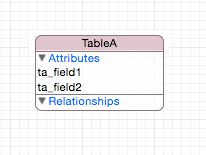

# ADGCoreDataKit

## Requirement

Swift 2.0 SDK beta 4

A set of classes for easy to use CoreData

## Examples

#### Without subclassing NSManagedObject

##### 1. Add a row and popuplate the UITableView

Given this model



This is the minimum amount of code to show the rows inserted in a table. This example doesn't need any NSManagedObject subclass

```swift

class ViewController: UITableViewController {

    override func viewDidLoad() {
        super.viewDidLoad()
        
        self.coreData = try! CoreDataManager(usingModelName: "Model")
        self.dataService = CoreDataService(usingCoreDataManager: coreData!, concurrencyType: NSManagedObjectContextConcurrencyType.MainQueueConcurrencyType)
                
        print("----- insert some rows ----")
        for (var i=0; i < 10; i++) {
            let _:NSManagedObject = try! self.dataService!.insert(entityName:"TableA", map: ["ta_field1":"value \(i)", "ta_field2":i])
        }
        print("----- get the array of managed object ----")
        let result:[NSManagedObject] = try! self.dataService!.findObjectsByEntity("TableA")
        print(result)
        
        print("----- create an array of dictionary elements representing the retrieved managed objects ----")
        self.datasource = self.dataService!.managedObjectsToDictionary(result)
        print(self.datasource)
        
        self.tableView.reloadData()
    }
}

```

#### Subclassing NSManagedObject

TODO
